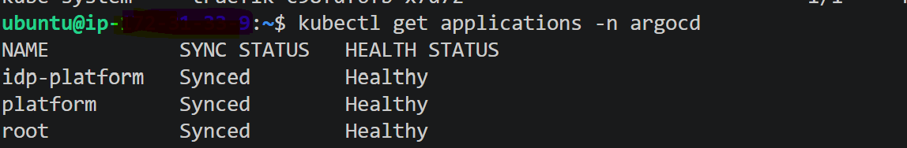
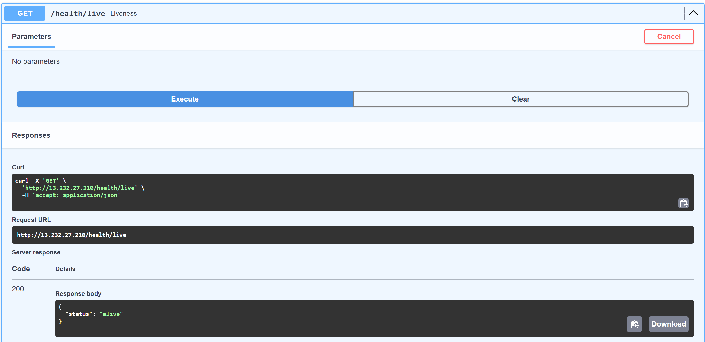

```
InternalDeveloperPlatformOROpenServiceBroker
├─ README.md
├─ infra
│  ├─ ansible
│  │  ├─ ansible.cfg
│  │  ├─ group_vars
│  │  │  └─ all.yaml
│  │  ├─ inventory.ini
│  │  ├─ playbooks
│  │  │  ├─ bootstrap.yaml
│  │  │  ├─ cluster.yaml
│  │  │  ├─ platform.yaml
│  │  │  └─ site.yaml
│  │  ├─ requirements.yaml
│  │  └─ roles
│  │     ├─ argocd
│  │     │  └─ tasks
│  │     │     └─ main.yaml
│  │     ├─ bootstrap
│  │     │  └─ tasks
│  │     │     └─ main.yaml
│  │     ├─ helm
│  │     │  └─ tasks
│  │     │     └─ main.yaml
│  │     ├─ ingress
│  │     │  └─ tasks
│  │     │     └─ main.yaml
│  │     └─ k3s
│  │        └─ tasks
│  │           └─ main.yaml
│  └─ terraform
│     ├─ .terraform.lock.hcl
│     ├─ ecr
│     │  ├─ main.tf
│     │  └─ outputs.tf
│     ├─ eks
│     │  ├─ main.tf
│     │  └─ variables.tf
│     ├─ iam
│     │  ├─ github_oidc.tf
│     │  ├─ main.tf
│     │  ├─ outputs.tf
│     │  └─ variables.tf
│     ├─ main.tf
│     ├─ outputs.tf
│     ├─ providers.tf
│     ├─ rds
│     │  ├─ main.tf
│     │  └─ variables.tf
│     ├─ redis
│     │  ├─ main.tf
│     │  └─ varibales.tf
│     ├─ sqs
│     │  └─ main.tf
│     ├─ variables.tf
│     └─ vpc
│        ├─ main.tf
│        └─ outputs.tf
└─ services
   ├─ api-python
   │  ├─ Dockerfile
   │  ├─ alembic
   │  ├─ app
   │  │  ├─ api
   │  │  │  ├─ auth.py
   │  │  │  ├─ deps
   │  │  │  │  └─ broker.py
   │  │  │  ├─ health.py
   │  │  │  ├─ jobs.py
   │  │  │  ├─ provision.py
   │  │  │  └─ status.py
   │  │  ├─ config
   │  │  │  └─ settings.py
   │  │  ├─ db
   │  │  │  ├─ database.py
   │  │  │  └─ models.py
   │  │  ├─ dependencies.py
   │  │  ├─ jobs
   │  │  │  ├─ base.py
   │  │  │  ├─ deployment_job.py
   │  │  │  ├─ factory.py
   │  │  │  └─ payment_job.py
   │  │  ├─ main.py
   │  │  ├─ middleware
   │  │  │  ├─ correlation_id.py
   │  │  │  ├─ idempotency.py
   │  │  │  ├─ ratelimit.py
   │  │  │  └─ request_logger.py
   │  │  ├─ providers
   │  │  │  ├─ aws_provider.py
   │  │  │  ├─ base.py
   │  │  │  ├─ factory.py
   │  │  │  ├─ k8_provider.py
   │  │  │  └─ postgres_provider.py
   │  │  ├─ repositories
   │  │  │  ├─ job_repository.py
   │  │  │  └─ service_repository.py
   │  │  ├─ schemas
   │  │  │  ├─ auth.py
   │  │  │  ├─ jobs.py
   │  │  │  └─ service.py
   │  │  ├─ services
   │  │  │  ├─ auth_service.py
   │  │  │  ├─ broker_service.py
   │  │  │  ├─ idempotency_service.py
   │  │  │  └─ job_service.py
   │  │  └─ utils
   │  │     ├─ exceptions.py
   │  │     └─ logger.py
   │  ├─ requirements.txt
   │  └─ tests
   └─ worker-python
      ├─ Dockerfile
      ├─ jobs
      │  └─ executer.py
      ├─ requirements.txt
      ├─ services
      │  └─ worker_service.py
      └─ worker
         ├─ __init__.py
         ├─ main.py
         └─ provision_worker.py

```