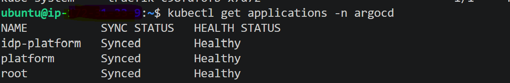
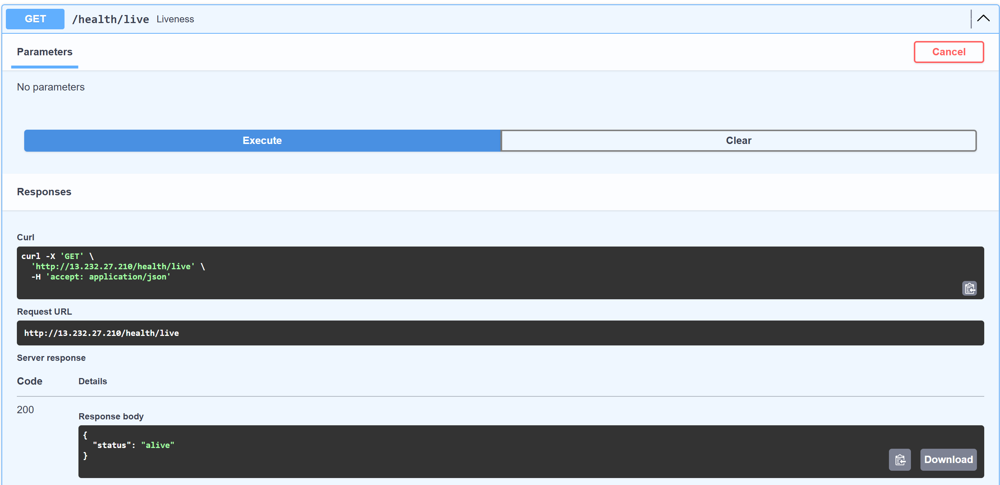

---

## Internal Developer Platform for resource provisioning

This workflow automates the build and deployment process for the IDP services.

**Features**

* Triggers automatically on every push to the `main` branch.
* Authenticates to AWS using GitHub Actions OIDC (no long-lived AWS keys).
* Logs in to Amazon ECR.
* Builds Docker images for:

  * API service
  * Worker service
* Pushes versioned images to Amazon ECR.
* Designed to integrate with a GitOps repository for automated Kubernetes deployments.

---

## Resource Provisioning

The IDP exposes REST APIs that provision cloud resources asynchronously.

**Workflow**

```text
Client
   │
   ▼
POST /api/v1/provision
   │
   ▼
API validates request
   │
   ▼
Stores Service Request & Job
   │
   ▼
Publishes message to Amazon SQS
   │
   ▼
Worker consumes message
   │
   ▼
AWS Provider
   │
   ├── PostgreSQL Database
   ├── Redis
   ├── S3 Bucket
   ├── SQS Queue
   ├── AWS Secrets Manager
   └── (Extensible for additional resources)
   │
   ▼
Updates Job Status
```

---

## Current Supported Resources

| Resource            | Status      |
| ------------------- | ----------- |
| PostgreSQL Database | ✅           |
| Redis               | ✅           |
| Amazon S3           | ✅           |
| Amazon SQS          | ✅           |
| AWS Secrets Manager | ✅           |
| Kubernetes Runtime  | Placeholder |
| Amazon ECS          | Planned     |

---

## Architecture Highlights

* Asynchronous provisioning using Amazon SQS.
* Provider Factory pattern for extensible resource provisioning.
* Modular provider implementation for each AWS service.
* Job tracking with persistent status updates.
* Designed for GitOps-based deployments.
* Easily extensible by implementing a new provider and registering it in the provider factory.

---

## Example Provisioning Request

```json
{
  "service_type": "backend",
  "provider": "aws",
  "parameters": {
    "service_name": "process-api",
    "environment": "development",
    "features": [
      "postgres",
      "redis",
      "s3",
      "sqs"
    ]
  }
}
```






Afer updateS:


```
InternalDeveloperPlatformOROpenServiceBroker
├─ README.md
├─ image-1.png
├─ image-2.png
├─ image.png
├─ infra
│  ├─ ansible
│  │  ├─ ansible.cfg
│  │  ├─ group_vars
│  │  │  └─ all.yaml
│  │  ├─ inventory.ini
│  │  ├─ playbooks
│  │  │  ├─ bootstrap.yaml
│  │  │  ├─ cluster.yaml
│  │  │  ├─ platform.yaml
│  │  │  └─ site.yaml
│  │  ├─ requirements.yaml
│  │  └─ roles
│  │     ├─ argocd
│  │     │  └─ tasks
│  │     │     └─ main.yaml
│  │     ├─ bootstrap
│  │     │  └─ tasks
│  │     │     └─ main.yaml
│  │     ├─ ecr-secret
│  │     │  └─ tasks
│  │     │     └─ main.yaml
│  │     ├─ helm
│  │     │  └─ tasks
│  │     │     └─ main.yaml
│  │     ├─ ingress
│  │     │  └─ tasks
│  │     │     └─ main.yaml
│  │     └─ k3s
│  │        └─ tasks
│  │           └─ main.yaml
│  └─ terraform
│     ├─ .terraform.lock.hcl
│     ├─ ecr
│     │  ├─ main.tf
│     │  └─ outputs.tf
│     ├─ eks
│     │  ├─ main.tf
│     │  └─ variables.tf
│     ├─ iam
│     │  ├─ ec2.tf
│     │  ├─ github_oidc.tf
│     │  ├─ main.tf
│     │  ├─ outputs.tf
│     │  └─ variables.tf
│     ├─ main.tf
│     ├─ outputs.tf
│     ├─ providers.tf
│     ├─ rds
│     │  ├─ main.tf
│     │  └─ variables.tf
│     ├─ redis
│     │  ├─ main.tf
│     │  └─ varibales.tf
│     ├─ sqs
│     │  └─ main.tf
│     ├─ variables.tf
│     └─ vpc
│        ├─ main.tf
│        └─ outputs.tf
└─ services
   ├─ api-python
   │  ├─ Dockerfile
   │  ├─ alembic
   │  ├─ app
   │  │  ├─ api
   │  │  │  ├─ auth.py
   │  │  │  ├─ deps
   │  │  │  │  └─ broker.py
   │  │  │  ├─ health.py
   │  │  │  ├─ jobs.py
   │  │  │  ├─ provision.py
   │  │  │  └─ status.py
   │  │  ├─ db
   │  │  │  └─ redis.py
   │  │  ├─ dependencies.py
   │  │  ├─ jobs
   │  │  │  ├─ base.py
   │  │  │  ├─ deployment_job.py
   │  │  │  ├─ factory.py
   │  │  │  └─ payment_job.py
   │  │  ├─ main.py
   │  │  ├─ middleware
   │  │  │  ├─ correlation_id.py
   │  │  │  ├─ idempotency.py
   │  │  │  ├─ ratelimit.py
   │  │  │  └─ request_logger.py
   │  │  ├─ schemas
   │  │  │  ├─ auth.py
   │  │  │  ├─ jobs.py
   │  │  │  └─ service.py
   │  │  ├─ services
   │  │  │  ├─ auth_service.py
   │  │  │  ├─ broker_service.py
   │  │  │  ├─ idempotency_service.py
   │  │  │  └─ job_service.py
   │  │  └─ utils
   │  │     ├─ exceptions.py
   │  │     └─ logger.py
   │  ├─ requirements.txt
   │  └─ tests
   ├─ idp-common
   │  ├─ idp_common
   │  │  ├─ config
   │  │  │  └─ settings.py
   │  │  ├─ db
   │  │  │  ├─ database.py
   │  │  │  ├─ postgres_admin.py
   │  │  │  └─ redis_admin.py
   │  │  ├─ messages
   │  │  │  ├─ __init__.py
   │  │  │  └─ sqs_client.py
   │  │  ├─ models
   │  │  │  ├─ __init__.py
   │  │  │  ├─ job.py
   │  │  │  └─ service_request.py
   │  │  ├─ providers
   │  │  │  ├─ aws_provider.py
   │  │  │  ├─ base.py
   │  │  │  ├─ factory.py
   │  │  │  ├─ k8_provider.py
   │  │  │  ├─ postgres_provider.py
   │  │  │  ├─ redis_provider.py
   │  │  │  ├─ s3_provider.py
   │  │  │  ├─ secrets_provider.py
   │  │  │  └─ sqs_provider.py
   │  │  ├─ repositories
   │  │  │  ├─ job_repository.py
   │  │  │  └─ service_repository.py
   │  │  └─ utils
   │  │     └─ secrets.py
   │  └─ pyproject.toml
   └─ worker-python
      ├─ Dockerfile
      ├─ jobs
      │  └─ executor.py
      ├─ requirements.txt
      ├─ services
      │  └─ worker_service.py
      └─ worker
         ├─ __init__.py
         ├─ main.py
         └─ provision_worker.py

```